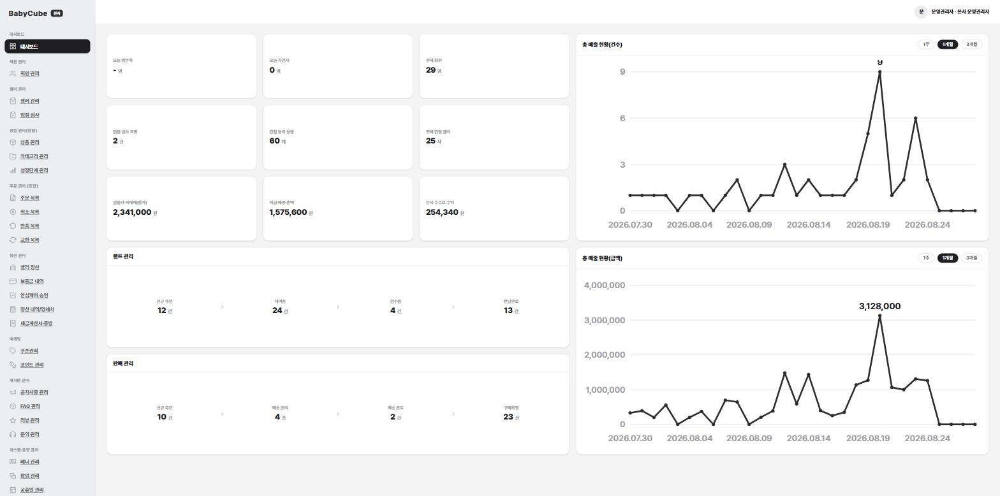
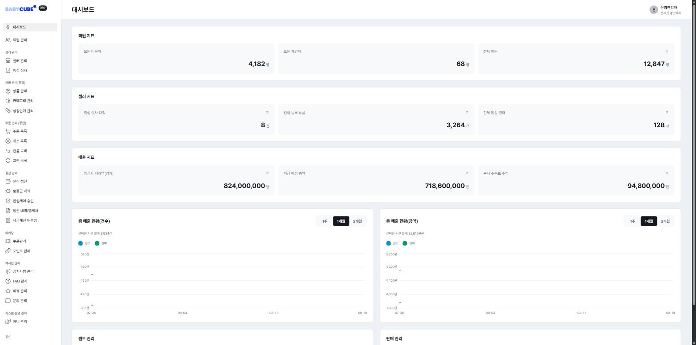

# 디자인 시스템 하네스 (기획서 → 대시보드 화면 올인원 템플릿)

> ### 🗺 폴더 전체 지도는 **[`GUIDE.md`](./GUIDE.md)** 에 있습니다 (무엇이 어디 있고 언제 무엇을 부르는가).
>
> ### 🛠 화면을 넘겨받아 제품에 태우신다면 **[`DEVELOPERS.md`](./DEVELOPERS.md)** 를 보세요.
>
> ### 👤 기획자라면 이 문서 말고 **[`START-HERE.md`](./START-HERE.md)** 를 보세요.
>
> 설치부터 결과 확인까지 전문용어 없이 한 장에 정리돼 있습니다.
> 아래는 **개발자용** 문서입니다.

기획자가 만든 기획서를 입력으로 **서비스 분석 → 화면 생성 → 배포**까지 체크포인트 방식으로
진행하는 **대시보드 제작 키트**다. 새 프로젝트는 이 폴더를 복사해 시작한다.

## 결과 미리보기 — Before / After

같은 서비스(BabyCube 본사 운영 어드민)의 **같은 대시보드 화면**이다.
왼쪽이 입력한 것, 오른쪽이 이 키트가 만든 것 — **내용(지표·숫자·메뉴)은 그대로이고,
달라진 것은 묶임과 순서다.**

<table>
<tr>
<th width="50%">Before — 클로드 프로토타입 대시보드</th>
<th width="50%">After — 이 키트가 만든 화면</th>
</tr>
<tr>
<td><a href="./docs/images/before-prototype.jpg"></a></td>
<td><a href="./docs/images/after-design-system.jpg"></a></td>
</tr>
</table>

|            | 무엇인가                            | 어디서 보나                                     |
| ---------- | ----------------------------------- | ----------------------------------------------- |
| **Before** | 클로드 프로토타입 대시보드          | <https://dev-babycube-admin.metamonster.co.kr/> |
| **After**  | 이 키트가 만든 화면 (**바로 열림**) | <https://babycube-admin-preview.vercel.app>     |
|            | 직접 띄워 보려면                    | `npm run dev` → <http://localhost:5173/>        |

> After 링크가 **이 저장소를 그대로 배포한 결과다** — `npm run build` → `vercel deploy --prod`
> 두 줄이면 누구나 같은 주소를 만든다(`START-HERE.md` §6). 로그인 없이 열린다.

무엇이 들어갔나 — **그룹**(흰 카드 = 묶음 / 회색 상자 = 항목, 두 층) · **수치**(값과 단위 분리) ·
**차트**(가로 격자만 · y축 폭 48 · 2계열이면 범례 필수) · **흐름**(`›` 로 이어진 단계) ·
**셸**(GNB 224 · 헤더 72 · gutter 40). 항목별 설명은 [`GUIDE.md`](./GUIDE.md) §2 에 있다.

## 빠른 시작

0. `node -v` (18+) · `claude --version` 확인 → `npm install` — 상세: `SETUP.md` §0
1. 기획서를 **`_plan/`에 넣거나**, URL이면 대화에 주소를 준다 — 받는 형태: `_plan/README.md`
2. Claude 대화에 **`프로젝트 작업 진행 시작`** 입력
3. 파이프라인이 단계별로 진행 — **각 체크포인트에서 검토·승인**
4. `npm run dev` → 첫 화면이 **화면 목록**이다 (만들어진 화면 전부가 카드로 나열됨)

## 파이프라인 (2단계)

| 단계              | 담당               | 산출물                                              |
| ----------------- | ------------------ | --------------------------------------------------- |
| 1 · 서비스 분석   | `service-analyzer` | `pipeline/01-service-brief.*` (화면 목록·기능·IA)   |
| **5 · 화면 생성** | `screen-builder`   | **`src/pages/*` 실제 React 화면** (템플릿 4종 변형) |

> 번호가 1 다음 5 인 이유 — 원래 브랜드(2a·2b·3)와 Figma(4) 단계가 있었으나 **삭제했다**.
> 실제로 돌리면 문서 표류로 빌드가 깨지는 상태였고, **대시보드 제작 경로는
> 애초에 그 단계를 거치지 않는다** — `01` 만 있으면 Stage 5 가 돈다.
> 색·타이포·간격은 이 저장소의 기존 토큰(Clay 계열)을 그대로 쓴다.

```
기획서 → 화면 목록 → React 화면 코드 → npm run build → vercel deploy → 공유 링크
```

개별 실행: `/analyze-plan` · **`/build-screens`** · `/run-pipeline` · `/build-tokens` · `/design-audit`

## 기술 스택

React 19 + TypeScript 5 · Tailwind v4 · Style Dictionary(토큰) · Storybook 8 · Vitest.
토큰은 2층 구조(`tokens/primitive` → `tokens/semantic`) → `src/tokens/_generated.css` 자동 생성.

## 문서 지도

- `docs/pipeline-architecture.md` — 파이프라인 규약·트리거
- `docs/token-architecture.md` — 토큰 2층 구조(Primitive→Semantic)
- `docs/naming-conventions.md` — 네이밍 규칙 단일 원천(파일·코드·토큰·Figma·ID·브랜드명)
- `docs/PROGRESS.md` — 구축 진행 기록(결정 이유·남은 일)
- `docs/DESIGN_참고.md` — 디자인 판단 가이드(사용 맥락·조합·§10 팔레트 프로토콜·인터랙션·접근성·엘리베이션·모션)
- `docs/DESIGN.md` — 컴포넌트 상세 수치 사전 · `docs/design-core.md` — 상시 로드 핵심
- `docs/DESIGN-dashboard.md` — **대시보드 레이어**(지표 타일·타일 그리드·수치 표현·차트 색 역할 4종·데이터 상태). `DESIGN.md` §0 과 §28 사이를 메운다
- `docs/schemas/` — 각 단계 산출물 계약
- `docs/screen-templates.md` — Stage 5 화면 템플릿 4종 카탈로그(유형 판정·계약·상태색 규칙)
- `START-HERE.md` — **기획자용 진입 문서** (설치→실행→확인, 전문용어 없음)
- `SETUP.md` — 새 프로젝트 셋업 체크리스트 (§0 전역 준비 포함)

## 주요 명령어

- `npm run build:tokens` — 토큰 빌드 (tokens/*.json → CSS)
- `npm run dev` / `npm run storybook` / `npm test` / `npm run typecheck` / `npm run build`
